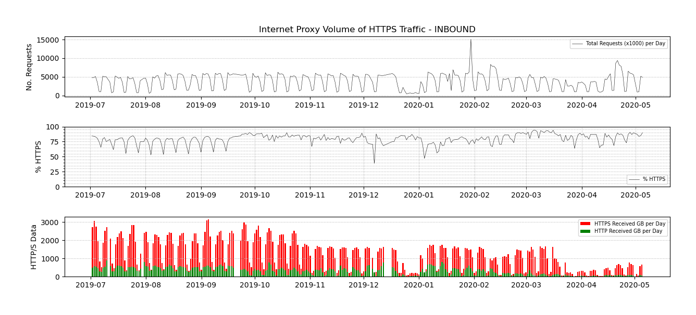

     

#Statistics from CSV to Graph using Pandas and Matplotlib  
-Python 3  
-Pandas  
-Matplotlib  

####EncryptionStats.py
This Python script can read data from a large number of CSV files, for example a daily file that is produced for several months or longer. It will produce a graph output and produce a graph output in PNG format.

